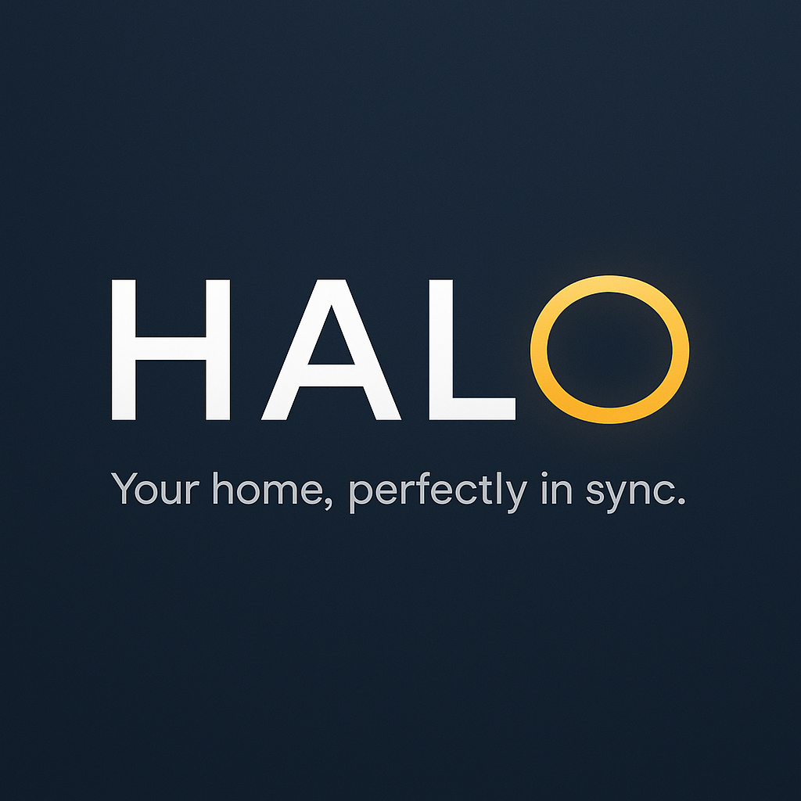

<p align="center">
    
</p>

<h1 align="center">HALO</h1>

## Intro

HALO is a modular **Node.js home automation platform** that uses **MQTT** for device communication and events, and an **SQLite Database** for
persistence.  
HALO supports **rule-based automation engine** with an API for web-based automation management.

---

## 🚀 Features

- **MQTT integration**: Devices publish state and events over MQTT topics.
- **Automation engine**: Rules are stored in the database and executed dynamically.
- **REST API**: Manage devices and automations via HTTP endpoints (for a future web UI).

## 📡 MQTT Topics

### Device State

- **Topic:** `device/<device_id>/state`
- **Payload (JSON):**

```json
{
    "attribute": "presence",
    "value": "active",
    "timestamp": "2025-08-15T22:10:00Z"
}
```
